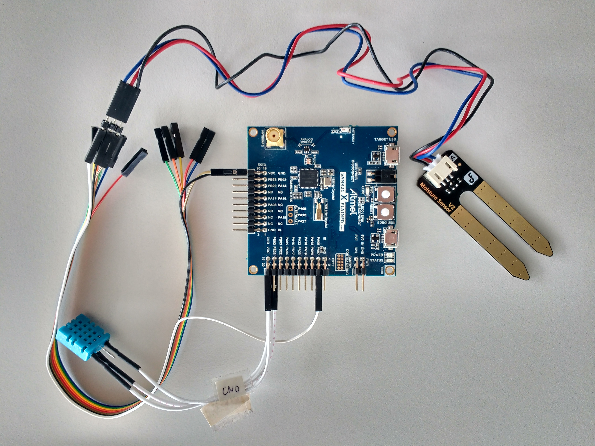

# Smart Gardening Team 2 (pflanzen2)
## Massimo Krause, Lukas Römer, Dorian Grosch

Präsentation: https://userpage.fu-berlin.de/doriangrosch/Pr%C3%A4si.pdf

### Benötigte Hardware

* **4 x** Atmel SAM R21 Xplained Pro 
* **1 x** Raspberry Pi als Gateway
* **8 x** Feuchtigkeitssensor
* **4 x** Temperatursensor
* **4 x** pH-Wert-Sensor
* **4 x** Helligkeitssensor
* **4 x** Batterie-Modul
* **1 x** 802.15.4-Dongle für RasPi

### Interne Kooperation

Github: https://github.com/fu-ilab-swp18/pflanzen2

Trello: https://trello.com/b/Fg7hORTF/pflanzen2

ShareLatex: https://de.sharelatex.com/9872211863bkkbstwzxffy

### OpenSenseMap

Test MQTT Server: broker.hivemq.com:1883
Topic(s): SWP_IK_PFL2/data/[boxID1,boxID2]/[sensorID1,sensorID2,..]
Message Ex.: [{"sensor":"5b14eda64cd32e00195ec2cc","value":"45.0"}]

## DHT Sensor Setup

### 802.15.4 6LoWPAN communication protocol proposal

- A message is considered as delivered successfully if the receiver acknowledges the call
- otherwise the sender will retry to deliver the message after a specified timeout
- a max number of retry attempts also has to be specified
- each sensor type gets assigned a fixed number (humidity=1, ...)
- using yaml as markup language with the following structure:
    - request:
    ```yaml
        msgID:  120936
        data:
            -   type:   1
                value:  54.3
            -   type:   2
                value:  36
    ```
    - response:
    ```yaml
        msgID:  120936
        ack:    1
    ```
- in order to integrate a new node into the network, the user needs to create a new entry in the pi's config yaml
- the next sensor node that sends an integration request will be considered as the valid candidate
    - integration request:
    ```yaml
        msgID:  893024
        intReq: true
    ```
    - response:
    ```yaml
        msgID:  893024
        ack:    1
        nodeID: 89
    ```
    - sensor node ack:
    ```yaml
        msgID:  893024
        ack:    1
    ```

cp ../RIOT/drivers/dht/include/dht_params.h ../RIOT/drivers/include/

Sonst kompiliert es nicht.

## Wiring

### DFR ground humidity sensor:
* Gold      -> GND
* Schwarz   -> VCC
* Weiß      -> PA06

### DHT11 temperature & air humidity sensor:
* Data      -> PB23



## Sensors IDs

| Sensor | ID |
| --- | --- |
| Temp | 1 |
| Air hum | 2 |
| Ground hum | 3 |

## IP Adresses

| Device | Adddress |
| --- | --- |
| RPI | fe80::1ac0:ffee:1ac0:ffee |
| Atmel 1 | fe80::7b68:2644:3053:30fa |

## RPL init
to speak with two boards do: make list-ttys
this will give you an overview from all your connected boards and ther serials.
to load the code to a specific board do: BOARD=samr21-xpro SERIAL="yourSerial" make flash all term 


## RPL testing
to trace a package in rpl-network use: nib route
to send a udp package from a node to the root node via 6lowpan and look at the details do the following:
root: udp server start 8888
node: udp send 2001:db8::1 8888 yourtext
